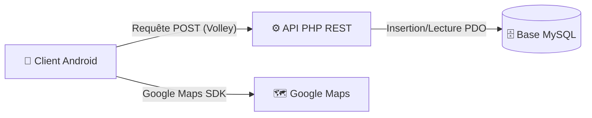

  <h1>📍 Système de Localisation Temps Réel</h1>
  
<i>Application Android professionnelle de suivi GPS avec backend PHP/MySQL et intégration Google Maps.</i>

  
  

    
    
    
    
  

---

## 📖 Sommaire
1. [À propos du projet](#-à-propos-du-projet)
2. [Architecture](#-architecture)
3. [Fonctionnalités Clés](#-fonctionnalités-clés)
4. [Prérequis](#-prérequis)
5. [Installation & Déploiement](#-installation--déploiement)
6. [Technologies Utilisées](#-technologies-utilisées)

---

## 🎯 À propos du projet

Bienvenue dans le dépôt du **Système de Localisation Temps Réel**. 
Ce projet complet illustre la mise en place d'une architecture client-serveur robuste permettant de :
- Récupérer les coordonnées GPS (latitude, longitude, altitude) depuis un appareil Android.
- Transmettre ces données de manière sécurisée et asynchrone à un serveur backend via une API REST.
- Sauvegarder l'historique des positions dans une base de données relationnelle.
- Visualiser le trajet en temps réel sur une interface cartographique interactive (Google Maps).

---

## 🏗️ Architecture

L'application suit une architecture distribuée moderne :

- **`database/`** : Scripts de migration SQL pour initialiser le schéma relationnel.
- **`server/`** : Backend PHP orienté objet (POO) implémentant le pattern DAO (Data Access Object) pour abstraire l'accès aux données.
- **`android/`** : Application mobile native gérant les permissions matérielles, les services de localisation et la couche réseau.

---

## ✨ Fonctionnalités Clés

- **📡 Suivi GPS Haute Précision** : Collecte continue des données spatiales avec gestion intelligente des intervalles de rafraîchissement.
- **🌐 Communication Asynchrone** : Appels réseau non bloquants grâce à la bibliothèque **Volley**.
- **💾 Persistance Robuste** : Stockage structuré des positions pour consultation ultérieure.
- **🗺️ Cartographie Dynamique** : Intégration du SDK Google Maps pour le tracé fluide des marqueurs de position.

---

## ⚙️ Prérequis

Avant de commencer, assurez-vous de disposer de l'environnement suivant :

> **Note Importante :** L'appareil Android (ou émulateur) et le serveur d'hébergement local doivent être connectés au **même réseau (Wi-Fi / LAN)**.

### Environnement de développement
- **Serveur Web Local** : XAMPP, WAMP ou LAMP (Apache, PHP 7+, MySQL).
- **IDE Mobile** : Android Studio (version la plus récente recommandée).
- **Appareil Cible** : Smartphone Android physique (Débogage USB actif) ou Émulateur avec Google Play Services.

### Clés API
- **Google Maps Android API** : Nécessite une clé valide générée depuis la [Google Cloud Console](https://console.cloud.google.com/).

---

## 🚀 Installation & Déploiement

### 1. Configuration de la Base de Données
1. Lancez votre serveur MySQL (via XAMPP/WAMP).
2. Accédez à votre interface d'administration (ex: phpMyAdmin).
3. Créez une nouvelle base de données nommée `localisation`.
4. Importez ou exécutez le script SQL présent dans `database/` pour générer la table `position`.

### 2. Déploiement du Backend API
1. Copiez le contenu du dossier `server/localisation/` vers le répertoire racine de votre serveur web (`htdocs` pour XAMPP, `www` pour WAMP).
2. Configurez les identifiants de la base de données dans `localisation/connexion/Connexion.php` si votre mot de passe MySQL diffère de celui par défaut (utilisateur `root`, sans mot de passe).
3. **Test rapide** : Visitez `http://localhost/localisation/showPositions.php` pour valider le fonctionnement de l'API.

### 3. Compilation de l'Application Android
1. Ouvrez **Android Studio** et créez un projet "Empty Activity" nommé `Localisation`.
2. Intégrez les sources fournies dans le dossier `android/` en respectant l'arborescence de votre projet.
3. **Configuration Réseau** :
   Dans les fichiers `MainActivity.java` et `MapsActivity.java`, localisez l'URL de l'API (ex: `192.168.43.228`). Remplacez cette valeur par **l'adresse IPv4 locale de votre ordinateur hébergeant le serveur**.
   *(Sous Windows : exécutez `ipconfig` dans l'invite de commandes).*
4. **Configuration Maps** :
   Assurez-vous d'avoir une *Google Maps Activity*. Dans le fichier `res/values/google_maps_api.xml`, insérez votre clé d'API Google Maps.
5. Synchronisez les dépendances Gradle et lancez la compilation sur votre appareil !

---

## 🛠️ Technologies Utilisées

| Catégorie | Technologie | Rôle |
|:---:|:---|:---|
| **Mobile** | Java, Android SDK | Développement de l'application cliente |
| **Réseau** | API Volley | Requêtes HTTP RESTful (POST/GET) |
| **Backend** | PHP, PDO | Traitement des requêtes métiers et accès BDD |
| **Base de Données**| MySQL | Stockage relationnel et persistance |
| **Cartographie**| Google Maps SDK | Rendu visuel cartographique interactif |

---

  <i>Projet réalisé dans le cadre d'un laboratoire académique sur le développement mobile et les services web.</i>

